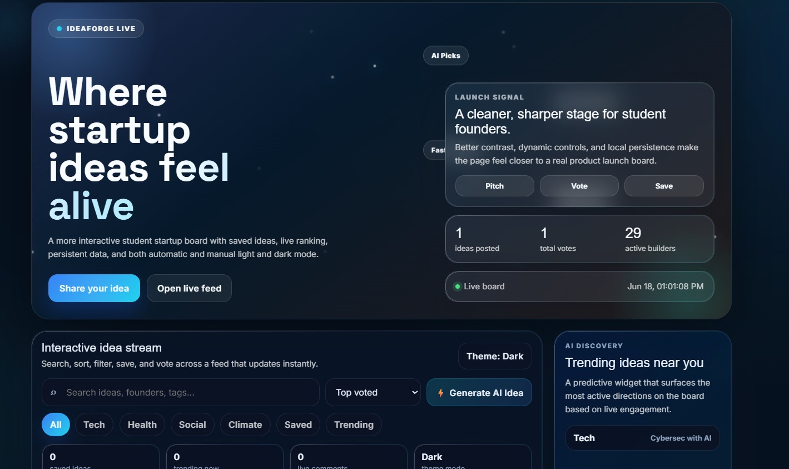
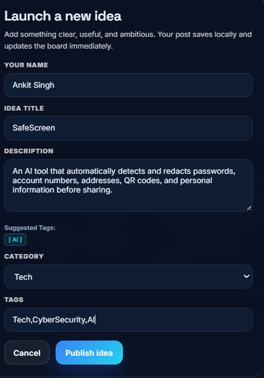
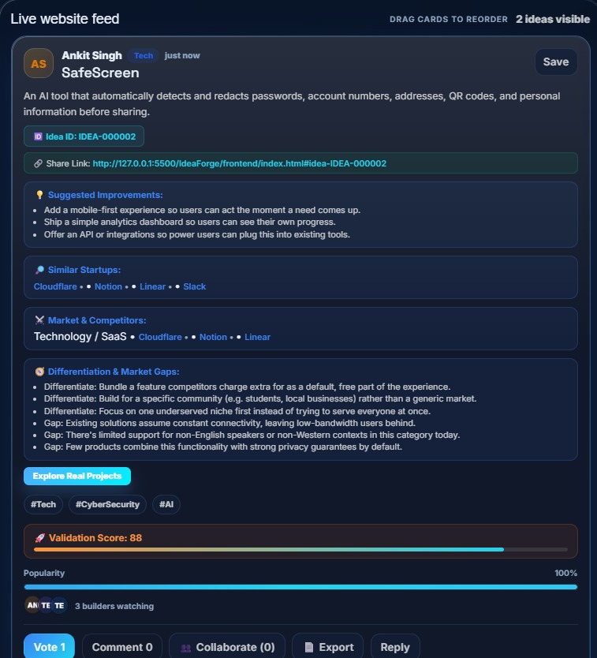
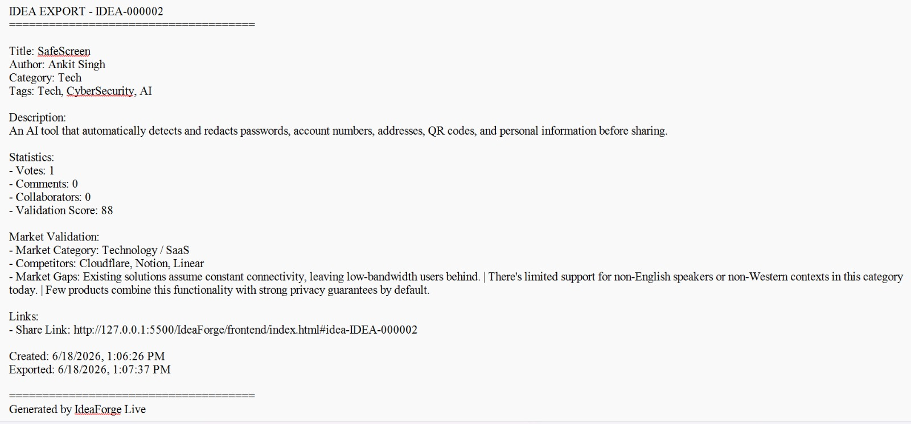
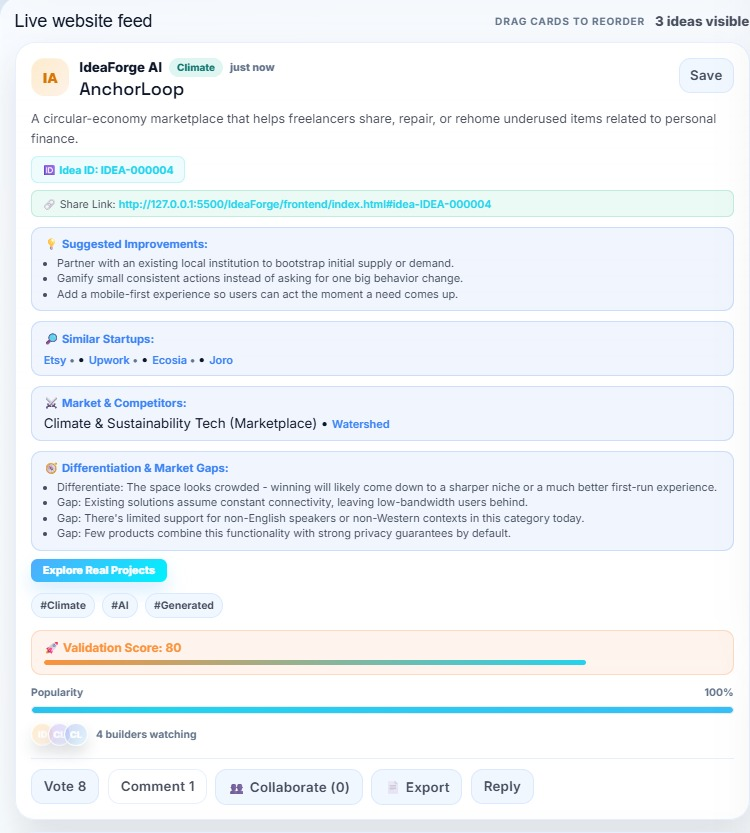
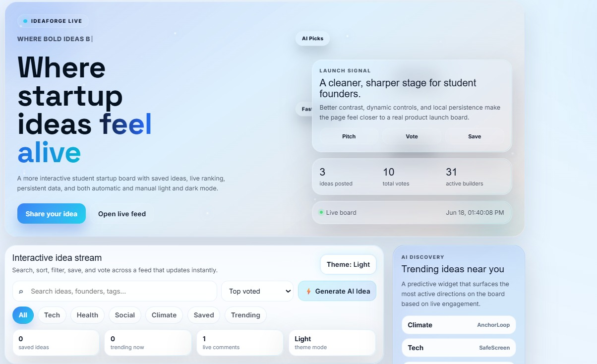

# IdeaForge

IdeaForge helps founders move from inspiration to execution by generating, validating, and refining startup ideas. It combines AI-powered analysis, market categorization, competitor discovery, validation scoring, and exportable reports in a seamless experience.Built with a FastAPI backend and a dynamic validation engine, it delivers real-time recommendations while preserving the original user experience.


---

## Overview

###  Home Screen

The landing page showcasing trending startup ideas, validation metrics, and the live idea feed.



---


###  Launch & Validate Ideas

Submit an idea and receive a validation score, market insights, competitor analysis, similar startups, and differentiation opportunities.



---


###  Featured Startup Ideas

Explore curated and AI-validated startup ideas from the community feed.



---


###  Export Ideas as PDF

Download and share startup ideas as professionally formatted PDF reports for collaboration, presentations, and feedback.



---


###  AI Idea Generation

Generate unique startup concepts instantly using the built-in AI idea generator.



---


###  Light Theme Support

Switch seamlessly between dark and light modes for a personalized experience.



---
##  Live Demo

Website: https://idea-forge-cy.vercel.app

API Docs: https://ideaforge-1-msuo.onrender.com/docs

---

## Features

- **Submit any startup idea** through a simple form (title, description,
  category, tags) and get an instant validation analysis.
- **Validation score (0-100)** - a transparent score based on description
  clarity, how crowded the market looks, differentiation signals, and
  completeness.
- **Similar startups & competitors** - pulled from live data sources when
  configured (Crunchbase, Product Hunt, Google Custom Search, Clearbit), with
  a built-in fallback so the app always returns useful results.
- **Market category classification**, **suggested improvements**,
  **differentiation opportunities**, and **market gaps** for every idea.
- **Generate AI Idea** - synthesizes a brand-new concept and analyzes it in
  one click.
- **Live feed** with search, filtering by category/tag, sorting (top, newest,
  most discussed), trending highlights, voting, commenting, saving, and
  shareable idea links.
- **Light/dark theme**, animated hero, and a fully responsive layout.

---

## Tech stack

| Layer | Stack |
|---|---|
| Frontend | HTML, CSS, vanilla JavaScript, served/built with Vite |
| Backend | FastAPI (Python) |
| Database | PostgreSQL |
| Deployment | Frontend on Vercel, backend on Render, database on Neon |

---

## Project structure

```
IdeaForge/
├── frontend/
│   ├── index.html          the application UI
│   ├── package.json
│   ├── vite.config.js
│   └── .env.example
└── backend/
    ├── main.py              FastAPI app entry point
    ├── requirements.txt
    ├── .env.example
    ├── Procfile
    └── app/
        ├── config.py        environment-driven settings
        ├── database.py      PostgreSQL connection/session
        ├── models.py        Idea database model
        ├── schemas.py        request/response models
        ├── seed.py           optional demo data
        ├── routers/ideas.py  API endpoints
        └── services/
            ├── orchestrator.py    runs the full analysis pipeline
            ├── heuristics.py      scoring & suggestion generation
            ├── knowledge_base.py  fallback market/company data
            ├── idea_generator.py  powers "Generate AI Idea"
```

---

## Getting started

### Prerequisites
- Node.js 18+ and npm
- Python 3.11+
- A PostgreSQL database (local, or a free Supabase/Neon project)

### Backend

```bash
cd backend
python -m venv .venv
source .venv/bin/activate        # Windows: .venv\Scripts\activate
pip install -r requirements.txt

cp .env.example .env
# edit .env and set DATABASE_URL to your Postgres instance

uvicorn main:app --reload
```

- API: `http://localhost:8000`
- Interactive docs: `http://localhost:8000/docs`

The `ideas` table is created automatically on first run. To start with a few
demo ideas, either set `SEED_DEMO_DATA=true` in `.env`, or run:

```bash
python -m app.seed
```

### Frontend

```bash
cd frontend
npm install

cp .env.example .env
# edit .env and set VITE_API_BASE_URL=http://localhost:8000

npm run dev
```

Open the URL Vite prints (usually `http://localhost:5173`).

---

## Environment variables

### Backend (`backend/.env`)

| Variable | Required | Description |
|---|---|---|
| `DATABASE_URL` | yes | PostgreSQL connection string |
| `ALLOWED_ORIGINS` | recommended | Comma-separated list of allowed frontend origins (CORS) |
| `SEED_DEMO_DATA` | no | `true` to insert demo ideas into an empty database on startup |
| `CRUNCHBASE_API_KEY` | no | Enables live Crunchbase organization search |
| `PRODUCTHUNT_API_TOKEN` | no | Enables live Product Hunt lookups |
| `GOOGLE_API_KEY` + `GOOGLE_CSE_ID` | no | Enables live Google Custom Search |
| `CLEARBIT_API_KEY` | no | Enables Clearbit company enrichment |

### Frontend (`frontend/.env`)

| Variable | Required | Description |
|---|---|---|
| `VITE_API_BASE_URL` | yes | URL of the backend API |

All four external API keys are optional - without them, IdeaForge's built-in
heuristic engine still returns a complete, useful analysis for any idea.

---

## API reference

| Endpoint | Description |
|---|---|
| `POST /ideas/analyze` | Analyze an idea (title, description, category, tags) without saving it |
| `POST /ideas/save` | Analyze and persist a new idea - used by the "Share Your Idea" form |
| `GET /ideas` | List all saved ideas, newest first |
| `GET /ideas/{id}` | Fetch a single idea by id |
| `POST /ideas/generate` | Synthesize, analyze, and save a new AI-generated idea - powers "Generate AI Idea" |

Example:

```bash
curl -X POST http://localhost:8000/ideas/save \
  -H "Content-Type: application/json" \
  -d '{
    "title": "DormPilot AI",
    "description": "An AI concierge for dorm life that handles maintenance requests, roommate coordination, and student FAQs.",
    "category": "Tech",
    "tags": ["AI", "Campus", "Productivity"],
    "author": "Jordan K."
  }'
```

Full interactive documentation is available at `/docs` once the backend is
running.

---

## Deployment

### Database - Supabase or Neon
Create a free project, copy the Postgres connection string, and set it as
`DATABASE_URL` on your backend host.

### Backend - Render or Railway
Deploy from the `backend/` folder. Build command: `pip install -r
requirements.txt`. Start command: `uvicorn main:app --host 0.0.0.0 --port
$PORT` (already configured in the included `Procfile`). Set the environment
variables listed above in your host's dashboard.

### Frontend - Vercel
Deploy from the `frontend/` folder. Vercel auto-detects Vite (build command
`npm run build`, output directory `dist`). Set `VITE_API_BASE_URL` to your
deployed backend URL as an environment variable.

After deploying, update `ALLOWED_ORIGINS` on the backend to include your
Vercel domain, then redeploy the backend so CORS allows requests from it.

---

## Author

Anwita Padhi
